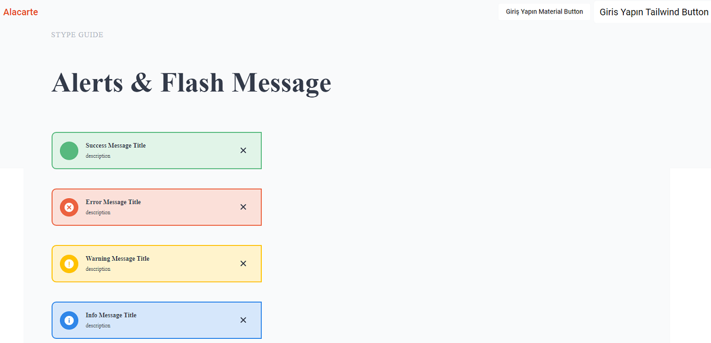
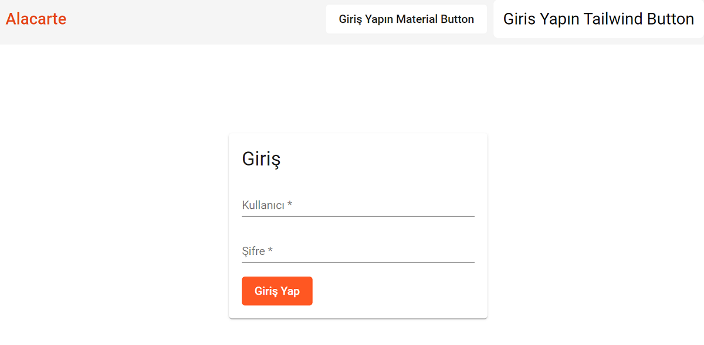

# Alacarte
Frontend work using Angular 13

# About alacarte

- Lazy loading
- Reusable component
- Standard code pattern
- Pixel-perfect

# Preview

# How to run this project

- Git clone or download source code.
- Open the terminal on the root directory of the project
- Run "npm install"
- Run "npm start"
- Visit the browser http://localhost:1700
